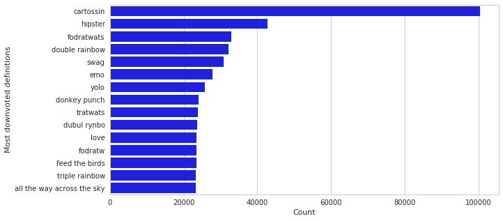
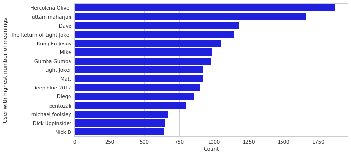
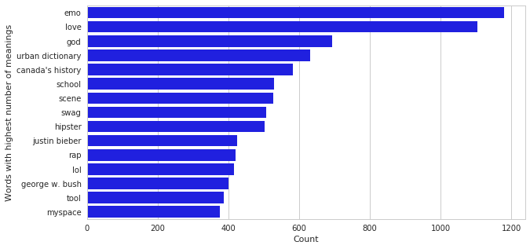
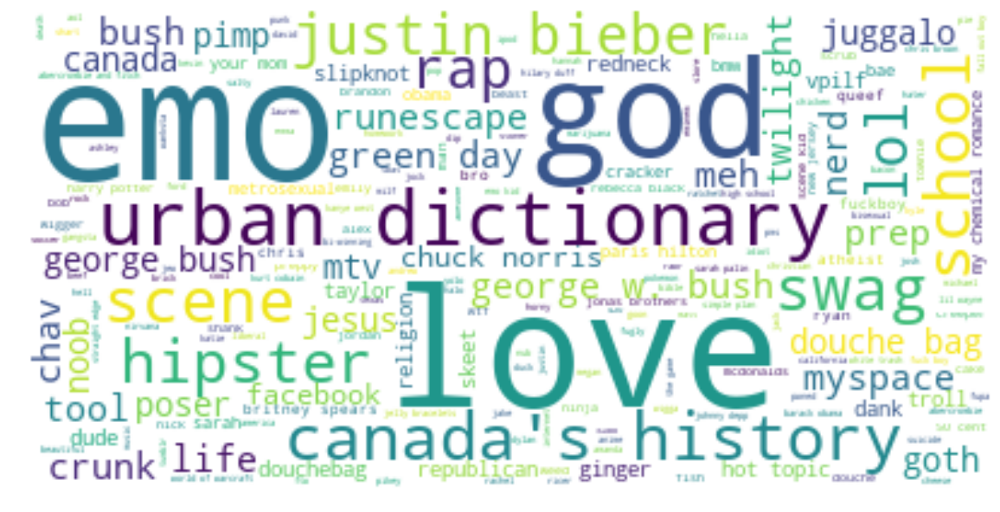
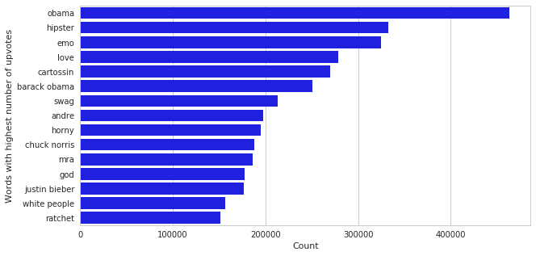
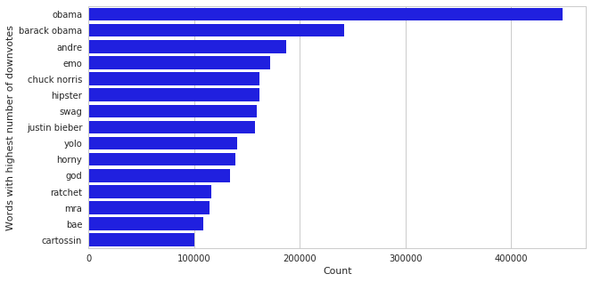
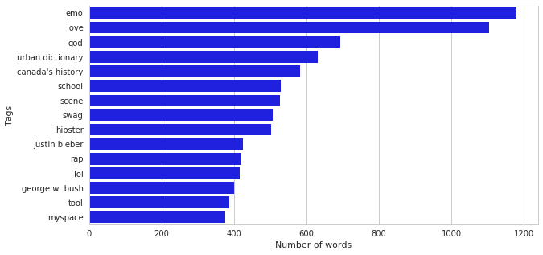
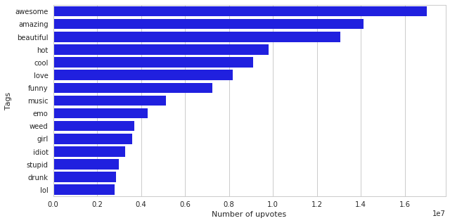
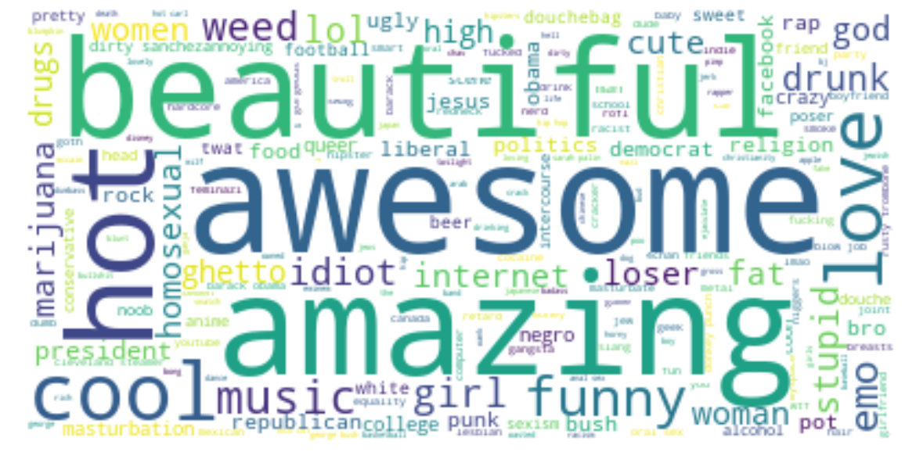

```python
import seaborn as sns
import pymongo as pm
import matplotlib.pyplot as plt
from pprint import pprint
from wordcloud import WordCloud
from pymongo import MongoClient

def draw_barplot(x, y, xlabel, ylabel):
    f, ax = plt.subplots(figsize=(10, 5))
    ax.set(xlabel=xlabel, ylabel=ylabel)
    sns.barplot(x=x, y=y, color="b")
    
def filter_words(l, name, count):
    counts = list()
    names = list()
    for d in l:
        if d[name] not in bad_words and d[name] not in names:
            counts.append(d[count])
            names.append(d[name])
    return [names, counts]

sns.set(style="whitegrid")
client = MongoClient("localhost:27017")
collection = client.Urbaner.dictionary

bad_words = ["sexy", "fuck", "bitch", "ass", "penis", "vagina", "shit", "cunt", "gay", "nigger", "asshole",
             "anal", "anus", "blowjob", "whore", "slut", "pussy", "cock", "boner", "cum", "dick",
             "fag", "faggot", "ho", "hoe", "homo", "jizz", "nigga", "tits", "porn", "orgasm", "feminism",
             "skank", "poop", "booty", "balls", "crap", "fart", "boobs", "butt", "black",
             "asian", "sex", "fucktard", "chode", "gate rape", "muslim", "feminist", "Anonymous", "anonymous", "rape", "islam"]
```


```python
# Query 1
l = ["_id", "lowercase_word", "tags", "thumbs_up", "thumbs_down", "author"]

for i in l:
    print(collection.count_documents({i : {"$exists" : False}}))
```

    0
    0
    0
    0
    0
    0


```python
# Query 2
l = ["_id", "lowercase_word", "tags", "thumbs_up", "thumbs_down", "author"]

for i in l:
    print(collection.count_documents({i : None}))

print(collection.count_documents({"tags":[]}))
```

    0
    0
    0
    0
    0
    0
    734948


```python
# Query 3
print(collection.count_documents({"_id" : { "$not" : {"$type" : "objectId"}}}))
print(collection.count_documents({"lowercase_word" : { "$not" : {"$type" : "string"}}}))
print(collection.count_documents({"tags" : { "$not" : {"$type" : "array"}}}))
print(collection.count_documents({"thumbs_up" : { "$not" : {"$type" : "int"}}}))
print(collection.count_documents({"thumbs_down" : { "$not" : {"$type" : "int"}}}))
print(collection.count_documents({"author" : { "$not" : {"$type" : "string"}}}))
```

    0
    0
    0
    0
    0
    0


```python
# Query 4
result = collection.find(
    {}, {"_id":0, "lowercase_word":1, "thumbs_up":1}).sort(
    "thumbs_up", pm.DESCENDING).limit(100)
result_to_list = list(result)
names, counts = filter_words(result_to_list, "lowercase_word", "thumbs_up")
draw_barplot(counts[0:15], names[0:15], "Count", "Most upvoted definitions")
```


```python
# Query 5
result = collection.find(
    {}, {"_id":0, "lowercase_word":1, "thumbs_down":1}).sort(
    "thumbs_down", pm.DESCENDING).limit(100)
result_to_list = list(result)
names, counts = filter_words(result_to_list, "lowercase_word", "thumbs_down")
draw_barplot(counts[0:15], names[0:15], "Count", "Most downvoted definitions")
```





```python
# Query 6
pipeline = [{"$sortByCount" : "$author"}, {"$limit":30}]
result = collection.aggregate(pipeline, allowDiskUse = True)
result_to_list = list(result)
names, counts = filter_words(result_to_list, "_id", "count")
draw_barplot(counts[0:15], names[0:15], "Count", "User with highest number of meanings")
```





```python
# Query 7
pipeline = [{"$sortByCount" : "$lowercase_word"}, {"$limit":1000}]
result = collection.aggregate(pipeline, allowDiskUse = True)
result_to_list = list(result)
names, counts = filter_words(result_to_list, "_id", "count")
draw_barplot(counts[0:15], names[0:15], "Count", "Words with highest number of meanings")

count_dict = {}
for i in result_to_list:
    count_dict[i["_id"]] = i["count"]
clean_dict = {key: count_dict[key] for key in count_dict if key not in bad_words}
wc = WordCloud(background_color="white", max_font_size=70).generate_from_frequencies(clean_dict)
plt.figure(figsize=(20,20))
plt.imshow(wc, interpolation="bilinear")
plt.axis("off")
```


    (-0.5, 399.5, 199.5, -0.5)








```python
# Query 8
pipeline = [
    {
      "$group": {
        "_id" : "$lowercase_word",
        "total_upvotes": { "$sum": "$thumbs_up" },
      }
    },
    {"$sort": {"total_upvotes":-1}},
    {"$limit": 100}
  ]

result = collection.aggregate(pipeline, allowDiskUse = True)
result_to_list = list(result)
names, counts = filter_words(result_to_list, "_id", "total_upvotes")
draw_barplot(counts[0:15], names[0:15], "Count", "Words with highest number of upvotes")
```





```python
# Query 9
pipeline = [
    {
      "$group": {
        "_id" : "$lowercase_word",
        "total_downvotes": { "$sum": "$thumbs_down" },
      }
    },
    {"$sort": {"total_downvotes":-1}},
    {"$limit": 100}
  ]

result = collection.aggregate(pipeline, allowDiskUse = True)
result_to_list = list(result)
names, counts = filter_words(result_to_list, "_id", "total_downvotes")
draw_barplot(counts[0:15], names[0:15], "Count", "Words with highest number of downvotes")

```





```python
# Query 10
pipeline =   [
    {
      "$group": {
        "_id" : "$lowercase_word",
        "count": { "$sum": 1 }
      }
    },
    {"$sort": {"count":-1}},
    {"$limit": 100}
  ]

result = collection.aggregate(pipeline, allowDiskUse = True)
result_to_list = list(result)
names, counts = filter_words(result_to_list, "_id", "count")
draw_barplot(counts[0:15], names[0:15], "Number of words", "Tags")
```





```python
# Query 11
pipeline =  [
    {"$unwind":"$tags"},
    {
      "$group": {
        "_id" : "$tags",
        "total_upvotes": { "$sum": "$thumbs_up" }
      }
    },
    {"$sort": {"total_upvotes":-1}},
    {"$limit": 1000}
  ]

result = collection.aggregate(pipeline, allowDiskUse = True)
result_to_list = list(result)
names, counts = filter_words(result_to_list, "_id", "total_upvotes")
draw_barplot(counts[0:15], names[0:15], "Number of upvotes", "Tags")
```





```python
count_dict = {}
for i in result_to_list:
    count_dict[i["_id"]] = i["total_upvotes"]
clean_dict = {key: count_dict[key] for key in count_dict if key not in bad_words}
wc = WordCloud(background_color="white", max_font_size=70).generate_from_frequencies(clean_dict)
plt.figure(figsize=(20,20))
plt.imshow(wc, interpolation="bilinear")
plt.axis("off")
```


    (-0.5, 399.5, 199.5, -0.5)





```python
# Query 12
pprint(list(collection.find({"lowercase_word":"love"}, {"definition":1, "ratio":1, "_id":0}).sort("ratio", pm.DESCENDING).limit(5)))
```

    [{'definition': 'A misunderstanding between two fools.',
      'ratio': 0.9333333333333333},
     {'definition': 'The most spectacular,indescribable,  deep euphoric feeling '
                    'for someone. \r\n'
                    '\r\n'
                    "Love is an incredibly powerful word. When you're in love, you "
                    "always want to be together, and when you're not, you're "
                    'thinking about being together because you need that person '
                    'and without them your life is incomplete.\r\n'
                    '\r\n'
                    'This love is unconditional affection with no limits or '
                    "conditions: completely loving someone. It's when you trust "
                    'the other with your life and when you would do anything for '
                    'each other. When you love someone you want nothing more than '
                    'for them to be truly happy no matter what it takes because '
                    "that's how much you care about them and because their needs "
                    'come before your own. You hide nothing of yourself and  can '
                    'tell the other anything because you know they accept you just '
                    'the way you are and vice versa.\r\n'
                    ' \r\n'
                    "It's when they're the last thing you think about before you "
                    "go to sleep and when they're the first thing you think of "
                    'when you wake up, the feeling that warms your heart and '
                    'leaves you overcome by a feeling of serenity. Love involves '
                    'wanting to show your affection and/or devotion to each other. '
                    "It's the smile on your face you get when you're thinking "
                    'about them and miss them.\r\n'
                    '\r\n'
                    'Love can make you do anything and sacrifice for what will be '
                    'better in the  end. Love is intense,and passionate. '
                    'Everything seems brighter, happier and more wonderful when '
                    "you're in love. If you find it, don't let it go.",
      'ratio': 0.8028144469132575},
     {'definition': "nature's way of tricking people into reproducing",
      'ratio': 0.8007985652894799},
     {'definition': 'Everyday...\r\n'
                    '\r\n'
                    '- I think of her in the clouds.\r\n'
                    '- I stay awake long nights seeing her in the ceiling.\r\n'
                    '- I write her name on my tests.\r\n'
                    '- I always think of her reaction may be before i decide.\r\n'
                    '- I smile when I think of her.\r\n'
                    '- I feel my pulse rise as I sense her.\r\n'
                    '- I feel complete when she talks to me...\r\n'
                    '\r\n'
                    '- I stare aimlessly at you.\r\n'
                    '- I see you embrace someone other than me.\r\n'
                    '- I smile and wave back at you.\r\n'
                    '- I feel my heart shattered and torn.\r\n'
                    '- I have a huge grin when I feel like I should cry.\r\n'
                    '- I say "Everything\'s all right!" when you question why.\r\n'
                    "- I cry because but I don't know why...\r\n"
                    '\r\n'
                    '- I think to myself, "She will never love me."\r\n'
                    '- I say to myself, "She won\'t love me as much as him."\r\n'
                    '- I convince myself, "She is more important than myself."\r\n'
                    '- I force myself, "She will never love me."\r\n'
                    '\r\n'
                    'So I keep quiet...\r\n'
                    '\r\n'
                    'All because I love you, is that a crime?',
      'ratio': 0.7868383404864091},
     {'definition': "Have you ever been in love? Horrible isn't it? It makes you "
                    'so \r\n'
                    'vulnerable. It opens your chest and it opens your heart and '
                    'it means \r\n'
                    'someone can get inside you and mess you up. You build up all '
                    'these \r\n'
                    'defenses. You build up this whole armor, for years, so '
                    'nothing could \r\n'
                    'hurt you, then one stupid person, no different from any other '
                    'stupid \r\n'
                    'person, wanders into your stupid life. . .you give them a '
                    'piece of \r\n'
                    "you. They don't ask for it. They do something dumb one day "
                    'like kiss \r\n'
                    "you or smile at you, and then your life isn't your own "
                    'anymore. Love \r\n'
                    'takes hostages. It gets inside you. It eats you out and '
                    'leaves you \r\n'
                    'crying in the darkness, so a simple phrase like \r\n'
                    '"maybe we should just be friends" or "how very perceptive" '
                    'turns into \r\n'
                    'a glass splinter working its way into your heart. It hurts. '
                    'Not just \r\n'
                    "in the imagination. Not just in the mind. It's a "
                    'should-hurt, \r\n'
                    'a body-hurt, a real gets-inside-you-and-rips-you-apart '
                    'pain. \r\n'
                    'I [hate] love.',
      'ratio': 0.7720111214087118}]

